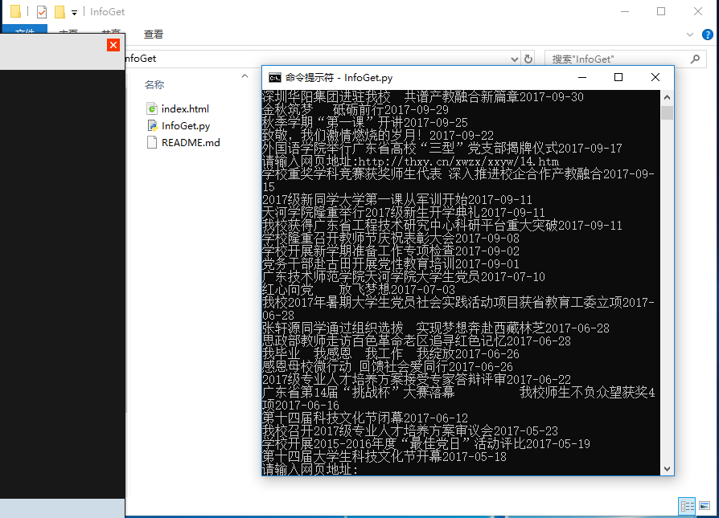

# InfoGet

该程序用于爬取广东技术师范学院天河学院 网址为：http://thxy.cn 新闻中心板块内的文章列表数据，仅作学习交流用途。

### 视频演示

## 使用说明

### step1: 
cd InfoGet\

### step2:
python InfoGet.py

### step3: 
可任意选择输入以下三个网址之一：

#### http://thxy.cn/xwzx/xxyw.htm 学校要闻
#### http://thxy.cn/xwzx/xxkx.htm 学校快讯
#### http://thxy.cn/xwzx/xxtz.htm 学校通知

## 执行完毕后会自动生成网页 index.html 

## 备注：

如果是Linux 平台 与 MAC平台 请自行修改字符集为 UTF-8 即可解决输出乱码问题

## 项目展示

#### 效果截图

